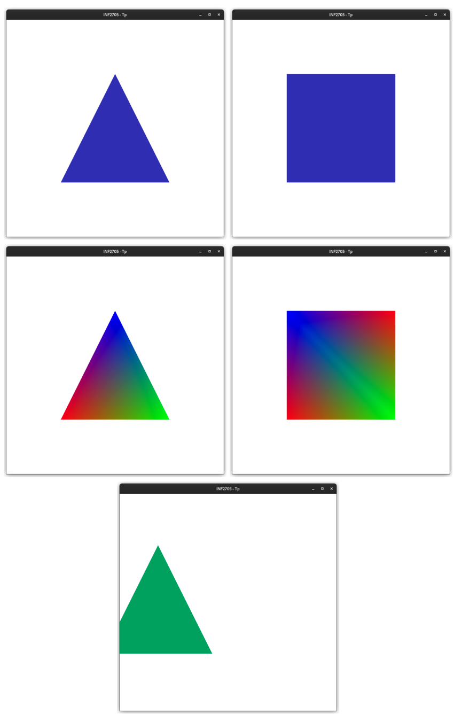
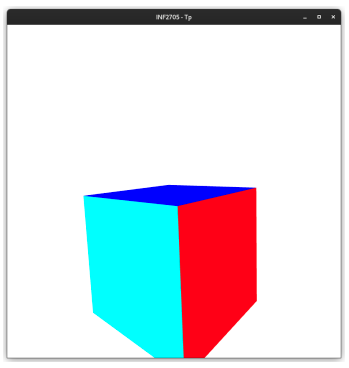
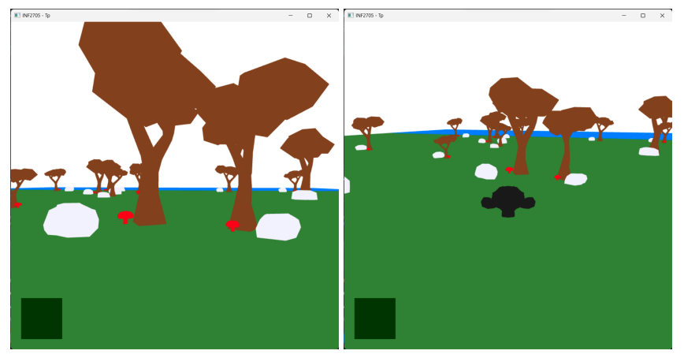
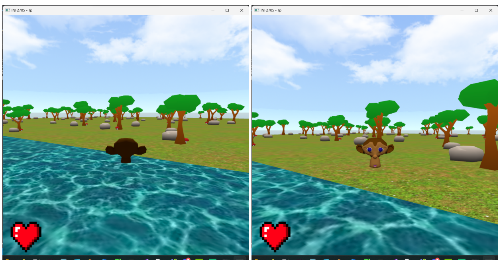
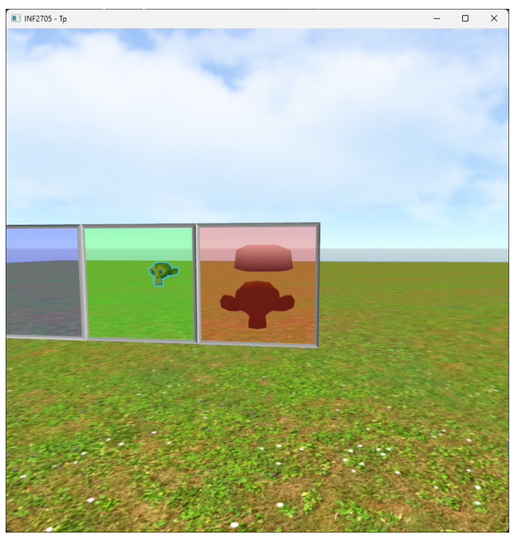

# INF2705 : Computer Graphics

## Table of Contents
1. [Introduction](#introduction)
2. [Introduction to OpenGL](#introduction-to-opengl)
3. [Matrix Transformation and Textures](#matrix-transformation-and-textures)
4. [Stencil and Phong, Gouraud, Flat Illumination](#stencil-and-phong-gouraud-flat-illumination)
5. [Tessellation and Feedback](#tessellation-and-feedback)
6. [Development](#development)
7. [Contributors](#contributors)

## Introduction
This repository contains all the files related to the INF2705 Computer Graphics assignments. Each assignment has its own section in the repository. The purpose of this readme is to provide a detailed overview of each assignment and the development process.

## Introduction to OpenGL
This assignment focuses on the basics of OpenGL.

### Part 1: Creating a Graphics Scene
This part focuses on creating a basic 3D scene. It involves drawing various shapes such as triangles and squares using OpenGL. The goal is to understand the basics of drawing 3D objects in a scene.

### Part 2: Transformations and Coordinate System
In this part, transformations are applied to the 3D objects in the scene. It involves implementing a transformation shader and applying different transformations to a 3D cube.

#### Figures

*The 7 shapes to be implemented in order*

*3D Cube*

## Matrix Transformation and Textures
This assignment focuses on matrix transformations and textures.

### Part 1: Creating a Graphics Scene
Similar to the previous assignment, the first part involves creating 3D scenes with different shapes and applying transformations to a 3D cube.

### Part 2: Texture Utilization
This part involves loading and using textures to add detail to the 3D objects in the scene. It also includes the implementation of a first-person camera and a heads-up display (HUD).

#### Figures

*Scene viewed in FPS and TPS*

*The scene after being textured*

## Stencil and Phong, Gouraud, Flat Illumination
This assignment focuses on stencil testing and different lighting models.

### Part 1: Stencil Testing
This part involves implementing a colored halo effect to distinguish between different objects in the scene using stencil testing.

### Part 2: Transformations and Coordinate System
Similar to the previous assignment, this part involves applying transformations and system coordinates to 3D objects in the scene.

#### Figures

*Halo Effect*

*Blending*

*Phong, Gouraud, and Flat Illumination*

*Phong, Gouraud, and Flat Illumination*

*Phong, Gouraud, and Flat Spotlight with the classic OpenGL algorithm*

*Phong, Gouraud, and Flat Spotlight with the classic Direct3D algorithm*

*Comparison with and without lightmaps applied to the sphere with Phong illumination*

## Tessellation and Feedback
This assignment focuses on tessellation and feedback.

### Part 1: Tessellation
This part involves implementing tessellation to define more details on certain elements in the scene and to update a large amount of data on the graphics card. It also includes particle system implementation for a special fire effect.

### Part 2: Feedback
This part includes configuration of feedback and drawing of particles to achieve special effects for the particle system. It also requires the use of blending and manipulation of particle properties over time.

#### Figures

*Tessellaction*

*Particle effect through TEX Retroaction*

## Development
Each assignment was developed using OpenGL 4 and written in C/C++. Various libraries were utilized for specific functionalities:
- **OpenGL**: Graphics rendering library for creating 3D scenes and applying transformations.
- **GLFW**: Library for creating windows, contexts, and handling input.
- **GLM**: Mathematics library for OpenGL, used for matrix transformations.
- **SOIL**: Library for loading image files as textures.
- **ImGui**: GUI library used for creating heads-up displays (HUD).
- **Assimp**: Library for importing 3D model files.

The development process for each assignment involved understanding the assignment requirements, implementing the necessary functionality using OpenGL and relevant libraries, testing the implementation, and optimizing performance where necessary. Challenges were often encountered during the implementation of advanced features such as tessellation and feedback, but these challenges were overcome through research, experimentation, and collaboration with peers.

## Contributors
- Omar Benzekri
- Thomas Rouleau
